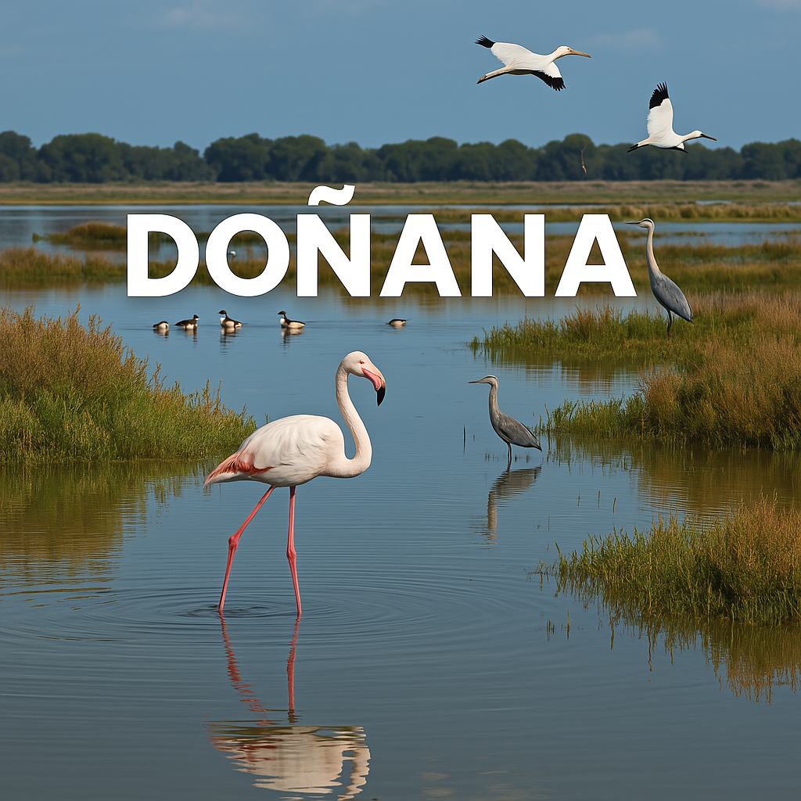

# Proyecto Aves de Doñana

# 1- TECNOLOGÍAS USADAS:

 

Lenguaje: Python 

Librerias: numpy, pandas, plotly, folium

# 2- 📖 Introducción

El Parque Nacional de Doñana es uno de los ecosistemas más ricos y diversos de Europa, reconocido por su papel clave en la conservación de aves migratorias. Gracias a su variedad de hábitats (marismas, dunas, bosques y matorrales), alberga una gran diversidad de especies a lo largo del año.

Este proyecto tiene como objetivo recopilar, analizar y visualizar datos en tiempo real sobre la presencia de aves en Doñana utilizando la API de eBird. A través de esta aplicación, buscamos ofrecer información actualizada sobre las especies observadas, su distribución y patrones de migración.

🔹 Objetivos del proyecto
Obtener datos recientes de observaciones de aves en Doñana mediante la API de eBird.

Procesar y estructurar la información en un formato accesible y fácil de analizar.

Desarrollar herramientas de visualización para explorar tendencias en la avifauna de la región.

Facilitar el acceso a datos relevantes para investigadores, ornitólogos y amantes de la naturaleza.

Este proyecto no solo permitirá conocer qué especies están presentes en Doñana en un momento determinado, sino que también contribuirá a la concienciación y conservación de este importante espacio natural.

 

